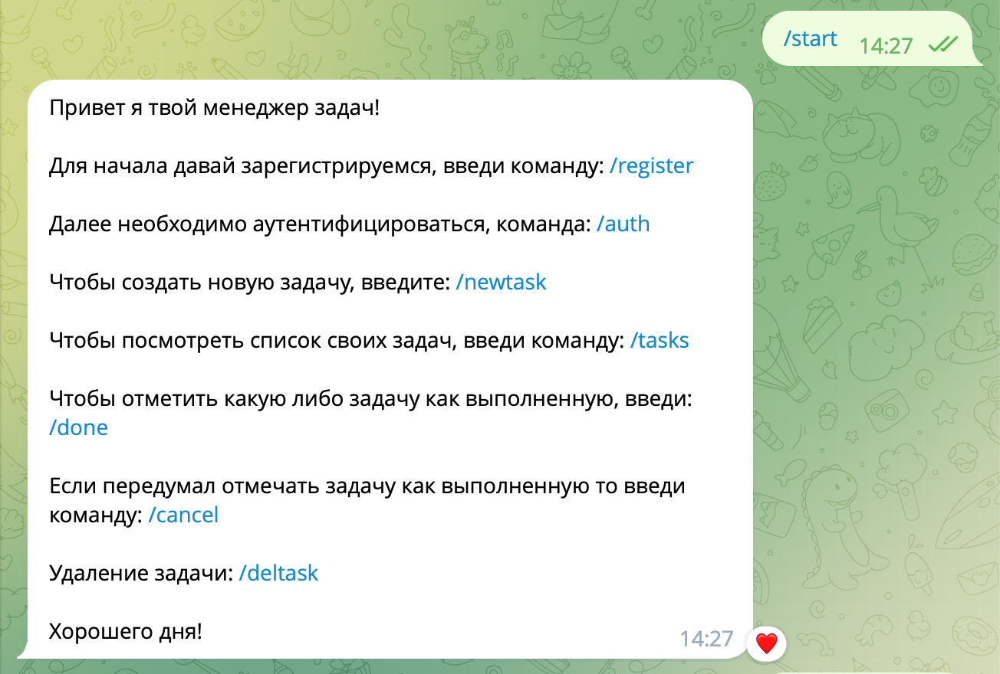

# Django Telegram API

## Клонируем репозиторий:

    git clone https://github.com/Mitsufiro/django_telegram_bot.git
## Устанавливаем зависимости

pip install -r requirements.txt

## Migrations

При изменении модели данных необходимо создать миграцию

`python manage.py makemigrations`

Для применения изменений, необходимо запустить

`python manage.py migrate`

Создайте суперюзера
`python manage.py createsuperuser`

Добавляем свой токен для бота и запускаем файл `main.py`

* /start

 

* /newtask
 

* /tasks
 

* /done
 

* /deltask
 

* Обработка ошибок
 
 
